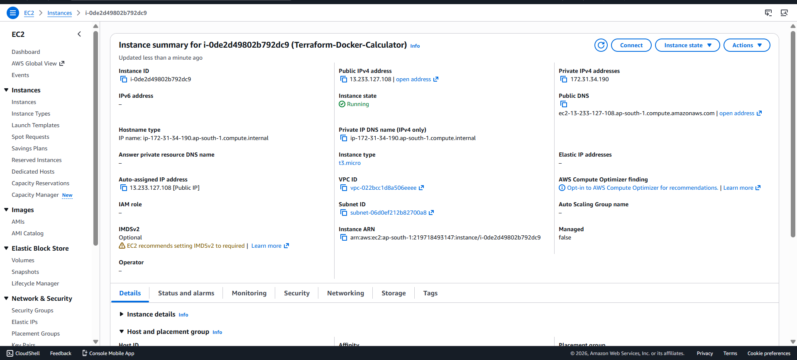
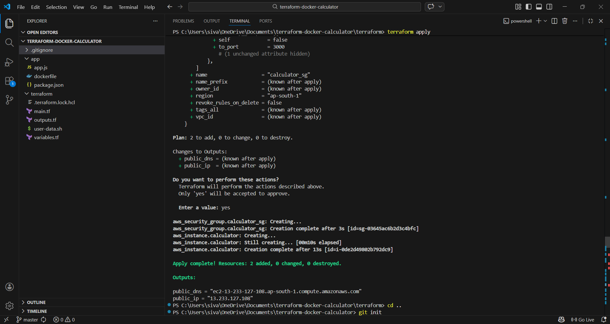
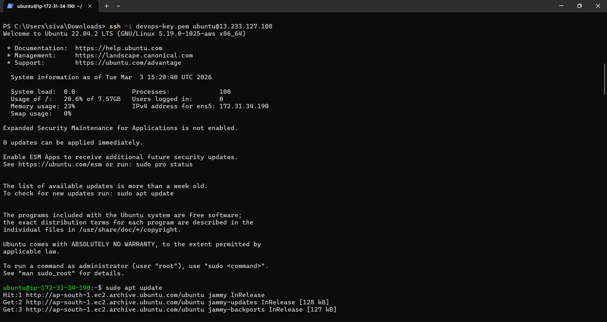
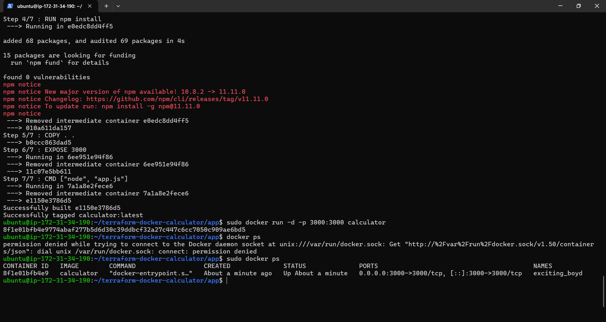
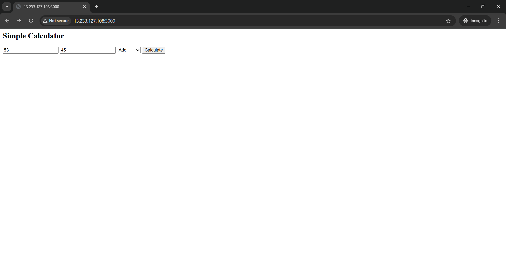
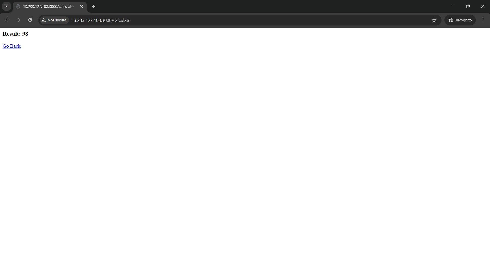

## 🚀 Terraform + Docker Deployment on AWS EC2

----

## 📌 Project Overview

This project demonstrates an end-to-end deployment of a Dockerized Node.js Calculator application on AWS EC2 using Terraform (Infrastructure as Code).

The objective of this project is to implement a real-world DevOps workflow including:

Infrastructure provisioning using Terraform

EC2 instance creation

Security Group configuration

Docker containerization

Remote deployment via SSH

Public application exposure

-------

## 🏗️ Architecture Flow

Local Machine
     ↓
Terraform
     ↓
AWS EC2 (Ubuntu)
     ↓
Docker Container
     ↓
Node.js Calculator Application
     ↓
Public IP:3000 (Browser Access)

-----

## 🛠️ Technologies Used

AWS EC2 (Ubuntu)

Terraform

Docker

Node.js

Git & GitHub

Linux (Ubuntu)

SSH

-----

## 🚀 Deployment Steps

## 1️⃣ Infrastructure Provisioning Using Terraform

Created EC2 instance using Terraform

Configured Security Group to allow inbound traffic on port 3000

Attached Key Pair for secure SSH access

Retrieved Public IP using Terraform output

## Commands Used
terraform init
terraform apply

## 2️⃣ Docker Image Build

Created Dockerfile for the Node.js application

Built Docker image

Exposed port 3000

Ran container in detached mode

## Commands Used
docker build -t calculator .
docker run -d -p 3000:3000 calculator

## 3️⃣ Remote Deployment on EC2

Connected to EC2 using SSH

Installed Docker inside Ubuntu server

Built Docker image inside EC2

Ran container in detached mode

Verified running container using:

docker ps

------

## 📸 Screenshots

Add your screenshots below after uploading them to your GitHub repository.

-----

## 📚 Key Learnings

Infrastructure as Code (IaC) using Terraform

AWS cloud provisioning and networking fundamentals

Docker container lifecycle management

Linux server administration

Security Group configuration

Deployment troubleshooting

Real-world DevOps workflow implementation

------

## 🔮 Future Improvements

Implement CI/CD using GitHub Actions

Attach Elastic IP to EC2 instance

Configure Nginx as Reverse Proxy

Enable HTTPS using SSL certificate

Automate Docker deployment using Terraform provisioners
